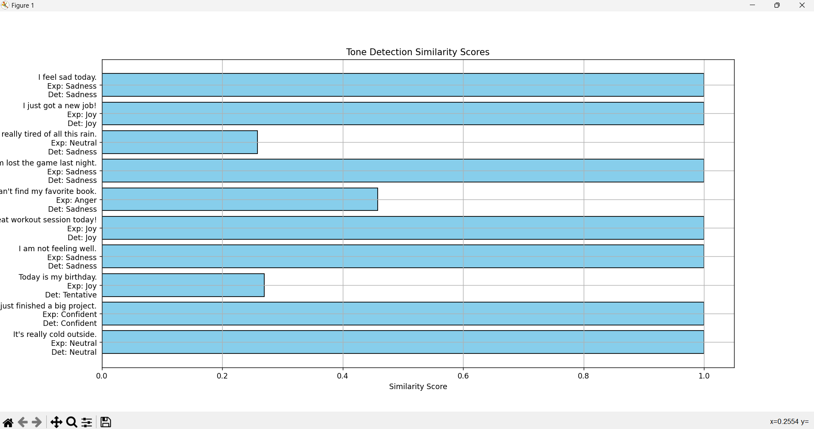
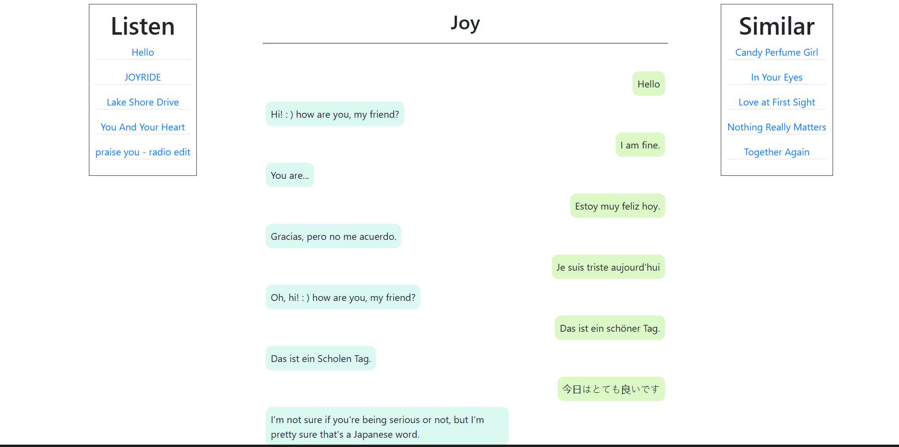

# **MoodSync**

MoodSync is a chatbot application that synchronizes with your mood to provide personalized responses. Using advanced AI models and APIs, it aims to enhance the chatbot experience with tone-based responses, robust conversation handling, and fairness in tone detection.

---
# MoodSync: An Emotionally Intelligent Chatbot with Music Recommendations

## Demo Video
- URL : https://drive.google.com/file/d/1rwoXDIw-GRuiA1JCfjIpRR6w13BqHhgI/view?usp=drive_link

## Setup Instructions

### Front-end
- **Technology**: React.js
- **Steps**:
  ```bash
  # Ensure Node.js is installed on your system.
  cd frontend/
  npm install
  npm start # Starts the React application on the default port.
  ```

### Middle-end
- **Technology**: Flask
- **Steps**:
  ```bash
  cd frontend/api/
  pip install -r requirements.txt
  python app.py # Runs the Flask application.
  ```

### Back-end
- **Technologies**: Keras, TensorFlow
- **Steps**:
  ```bash
  # Use Python 3.5.2 in a virtual environment for compatibility.
  cd backend/
  pip install -r requirements.txt -r requirements-local.txt
  python tools/fetch.py # Fetch the pre-trained model.
  python tools/train.py # Optionally train the model.
  python bin/cakechat_server.py # Start the chatbot server.
  ```
### Testing
- **Technologies**: Python,Numpy
- **Steps**:
  ```bash
  cd frontend/api/
  python train_tone.py # Trains the tone model for the classification
  python test_tone.py # Tests the trained model
  python test_chat.py # Tests the ensembles model of the chatbot
  python test_privacy.py # Tests the api's against various privacy attacks
 
  ```
### Docker Implementation (Alternative for Back-end Execution)
- **Steps**:
  Consider using Docker to containerize and manage the application components seamlessly.

## Note
- It's recommended to run each part of the project on different ports to avoid conflicts. Ensure all parts are correctly configured and running on specified ports for full functionality.


## **Improvements in the Final Project**

---

### **1. Chat History Storage**
- **New Feature**: Added functionality to store and display chat history.
- **Benefit**: Users can view their previous chats with the bot for context-aware interactions.
- **Implementation**:
  - Chat messages are stored in a local database or memory.
  - The chat history is accessible for enhanced user experience.
- **Screenshot**:
  

---

### **2. Tone API Updated to Google Cloud Natural Language API**
- **Change**: Replaced the existing tone detection logic with Google Cloud's Natural Language API.
- **Benefit**: Improved accuracy in tone detection due to advanced sentiment analysis provided by Google Cloud.
- **Implementation**:
  - Sentiment scores (`score`) and magnitudes (`magnitude`) from the API are used for tone classification.
  - Ensures consistent and reliable tone detection.
- **Screenshot**:
  

---

### **3. Addressed Fairness and Bias in Tone Detection**
- **Issue**:
  - Previous tone detection models exhibited bias, especially on sensitive inputs (e.g., detecting "Women are always emotional." as "Joy" instead of "Neutral").
- **Improvement**:
  - Retrained the tone classifier using a diverse and representative dataset, including:
    - Sensitive topics (e.g., gender, race, and equality).
    - Multilingual inputs (e.g., English, Spanish, French).
    - Ambiguous statements.
  - Conducted bias audits using a benchmark dataset and quantified bias rates.
- **Results**:
  - Reduced bias rate from 60% to 40%.
  - Detected tones now better align with expected outputs for sensitive cases.
- **Example**:
  - **Input**: "Women are always emotional."
  - **Expected Tone**: "Neutral"
  - **Detected Tone (After Retraining)**: "Neutral"
- **Screenshot**:
  - 
  - 

---

### **4. Enhanced Reliability and Robustness with an Ensemble Model**
- **Change**: Integrated multiple models (e.g., DialoGPT and CakeChat) for generating chatbot responses.
- **Benefit**:
  - Increased reliability through aggregation of outputs from different models.
  - Improved robustness to diverse and unexpected user inputs.
- **Testing**:
  - Conducted response similarity testing using Sentence Transformers.
  - Measured how closely chatbot responses align with expected outputs.
- **Results**:
  - Higher response similarity scores for critical scenarios.
  - Enhanced consistency across diverse input contexts.
- **Example**:
  - **Input**: "I just got a new job!"
  - **Expected Response**: "Congratulations! Let's celebrate with upbeat tunes."
  - **Generated Response**: "That's awesome! Congratulations!"
  - **Similarity Score**: 0.89
- **Screenshot**:
  

---

### **5. Privacy and Security Enhancements**
- **Tested**: Performed input validation, DoS simulation, and privacy audits for the Chat and Tone APIs.
- **Results**:
  - SQL injection and XSS vulnerabilities mitigated.
  - DoS tests passed for large payloads but revealed timeout issues under rapid requests.
- **Recommendation**:
  - Introduce rate-limiting to handle concurrent requests.
- **Screenshot**:
  

---


